# 🚀 AI Editor Frontend

[](LICENSE)
[](https://github.com/evillan0315/ai-editor-front/issues)
[](https://github.com/evillan0315/ai-editor-front/pulls)
[](https://github.com/evillan0315/ai-editor-front/commits)

> A React frontend for the AI Editor backend, built with Vite, React, Nanostores, Tailwind CSS **v4**, and Material UI **v7**, focusing on intelligent code assistance and file system interaction.

---

## 📖 Table of Contents

- [Features](#-features)
- [High-Level Architecture](#-high-level-architecture)
- [Project Structure](#-project-structure)
- [Requirements](#-requirements)
- [Installation](#-installation)
- [Usage](#-usage)
- [API Reference](#-api-reference)
- [Environment Variables](#-environment-variables)
- [Testing](#-testing)
- [Deployment](#-deployment)
- [Git Workflow](#-git-workflow)
- [Roadmap](#-roadmap)
- [Contributing](#-contributing)
- [License](#-license)
- [Acknowledgements](#-acknowledgements)
- [Contact](#-contact)

---

## ✨ Features

- 🤖 **AI-Powered Code Generation & Modification**: Interact with a powerful AI to generate new files, modify existing ones, **repair code with suggestions**, or delete files based on natural language instructions.
- 💡 **Interactive Proposed Changes**: View AI's proposed changes with detailed file paths, action types (ADD, MODIFY, DELETE, **REPAIR**, ANALYZE), and AI-generated reasons. Selectively apply or discard individual changes, and even **edit the proposed content before application**.
- 📊 **Git Diff Visualization**: Inspect detailed git diffs for proposed modifications and deletions directly within the editor before applying changes, ensuring transparency and control.
- 🏃 **Direct Git Command Execution**: Execute AI-generated `git` instructions (e.g., `git add .`, `git commit`) directly from the UI, with immediate display of terminal output and errors.
- 🔒 **Secure Authentication**: Seamlessly log in using Google or GitHub OAuth2, or **with standard email/password**, for secure access to the editor, with user session management handled by the backend.
- 📂 **Project Context & Scanning**: Specify a project root path and relevant scan paths for the AI to analyze, providing crucial context for intelligent code suggestions and understanding project structure. Includes an interactive file picker dialog for easy path selection.
- 🚀 **File Tree Navigation & Content Viewing**: Browse your project's file structure with an interactive file tree, allowing for easy exploration, selection of files, and direct viewing of their current content in a dedicated editor panel. You can manually edit the content of proposed AI changes, but **opened files from the file tree are currently read-only, and the viewer is hidden when AI responses are active to prioritize proposed changes**.
- ⬆️ **File/Image Upload for AI Context**: Upload files or paste Base64 data (e.g., images, text files) to provide additional context to the AI, enabling multi-modal requests.
- 📝 **Customizable AI Instructions & Output Format**: Modify the underlying AI system instructions and the expected output JSON schema directly within the UI, allowing for fine-tuned control over AI behavior.
- ⚙️ **Selectable AI Request Types**: Choose between various request types (e.g., `TEXT_ONLY`, `TEXT_WITH_IMAGE`, `TEXT_WITH_FILE`, `LLM_GENERATION`) to optimize AI interaction based on your input and desired outcome.
- 🌍 **Modern UI/UX**: Built with React, Material-UI **v7**, and Tailwind CSS **v4** for a responsive, accessible, and intuitive user experience.
- ⚡ **Vite Development**: Fast development and build times powered by Vite, providing a modern and efficient development workflow.
- 🌗 **Dark/Light Theme Toggle**: Effortlessly switch between dark and light modes, enhancing readability and user comfort.

---

## 🗺️ High-Level Architecture

```mermaid
graph LR
    subgraph "Frontend (Client - React / Vite / TS / MUI / Tailwind)"
        Browser[User Browser]
        UI[React UI Components]
        Pages(Pages - AiEditorPage, LoginPage etc.)
        State(Nanostores - aiEditorStore, authStore, fileTreeStore, themeStore)
        Services(Frontend Services / API Clients)
        Router[React Router DOM]
    end

    subgraph "Backend (Server - NestJS / Node.js)"
        API[REST API Endpoints]
        Auth(Auth Service)
        LLM(LLM Orchestration Service)
        File(File System Service)
        Terminal(Terminal Execution Service)
        DB[(Database)]
        AI_Provider[AI Provider &lpar;e.g., Gemini&rpar;]
        FS[Project File System]
    end

    Browser -- Renders --> UI
    UI -- User Input --> Pages
    Pages -- Actions / Data --> State
    State -- Updates --> UI
    State -- API Calls --> Services
    Services -- HTTP/S Requests --> API
    API -- Delegates --> Auth
    API -- Delegates --> LLM
    API -- Delegates --> File
    API -- Delegates --> Terminal
    Auth -- Reads/Writes --> DB
    LLM -- Requests/Responses --> AI_Provider
    File -- Reads/Writes --> FS
    Terminal -- Executes --> FS
    Terminal -- Executes --> Shell(Shell Commands)
    API -- HTTP/S Responses --> Services
    Services -- Data --> State
    Router -- Navigates --> Pages

    style Frontend fill:#f9f,stroke:#333,stroke-width:2px
    style Backend fill:#ccf,stroke:#333,stroke-width:2px
    style State fill:#fff,stroke:#333,stroke-width:1px
    style Services fill:#fff,stroke:#333,stroke-width:1px
    style API fill:#fff,stroke:#333,stroke-width:1px
    linkStyle 0 stroke:#0a0,stroke-width:2px;
    linkStyle 1 stroke:#0a0,stroke-width:2px;
    linkStyle 2 stroke:#0a0,stroke-width:2px;
    linkStyle 3 stroke:#0a0,stroke-width:2px;
    linkStyle 4 stroke:#f60,stroke-width:2px;
    linkStyle 5 stroke:#f60,stroke-width:2px;
    linkStyle 6 stroke:#f60,stroke-width:2px;
    linkStyle 7 stroke:#f60,stroke-width:2px;
    linkStyle 8 stroke:#f60,stroke-width:2px;
    linkStyle 9 stroke:#f60,stroke-width:2px;
    linkStyle 10 stroke:#f60,stroke-width:2px;
    linkStyle 11 stroke:#f60,stroke-width:2px;
    linkStyle 12 stroke:#f60,stroke-width:2px;
    linkStyle 13 stroke:#f60,stroke-width:2px;
    linkStyle 14 stroke:#f60,stroke-width:2px;
    linkStyle 15 stroke:#f60,stroke-width:2px;
```



---

## 📂 Project Structure

```bash
ai-editor-front/
├── public/             # Static assets (e.g., vite.svg)
├── src/                # Source code for the React application
│   ├── api/            # API client functions for interacting with the backend (e.g., `auth.ts`, `file.ts`, `llm.ts`, `terminal.ts` for operations like authentication, file management, LLM requests, and terminal commands)
│   ├── assets/         # Static assets like images/icons (e.g., react.svg)
│   ├── components/     # Reusable React components
│   │   ├── dialogs/    # Modal dialog components (e.g., `FileUploaderDialog.tsx`, `InstructionEditorDialog.tsx`)
│   │   ├── file-tree/  # Components for rendering and interacting with the project's file tree (`FileTree.tsx`, `FileTreeItem.tsx`)
│   │   ├── ui/         # Wrapper components for Material-UI elements (e.g., `Button.tsx`, `TextField.tsx`, `CircularProgress.tsx`)
│   │   └── ...         # Other general UI components (e.g., `Layout.tsx`, `Navbar.tsx`, `Loading.tsx`, `WelcomeMessage.tsx`, `PromptGenerator.tsx`, `FilePickerDialog.tsx`, `AiResponseDisplay.tsx`, `OpenedFileViewer.tsx`, `ProposedChangeCard.tsx`, `ThemeToggle.tsx`)
│   ├── constants/      # Global constants, default AI instruction templates, and configuration values
│   ├── pages/          # Top-level page components, defining the main views of the application (e.g., `AiEditorPage.tsx`, `LoginPage.tsx`, `AuthCallback.tsx`, `RegisterPage.tsx`)
│   ├── routes/         # Application routing setup (currently defined in `App.tsx` using React Router DOM)
│   ├── services/       # Business logic for API calls, authentication state management, and other non-UI related operations (e.g., `authService.ts`)
│   ├── stores/         # Nanostores for centralized, reactive global state management (e.g., `authStore.ts`, `aiEditorStore.ts`, `fileTreeStore.ts`, `themeStore.ts`)
│   ├── types/          # TypeScript type definitions for API responses, application state, and domain models (`auth.ts`, `fileTree.ts`, `index.ts`)
│   └── utils/          # General utility functions (e.g., `fileUtils.ts` for path manipulation and file tree building, `index.ts` for CodeMirror language extensions, debounce)
├── .env                # Environment variables (local overrides for development, not committed)
├── .env.local          # Local environment variables (sensitive data, not committed to VCS)
├── eslint.config.ts    # ESLint configuration for code quality and style
├── index.html          # Main HTML entry point for the single-page application
├── package.json        # Project dependencies, scripts, and metadata
├── README.md           # Project documentation (this file)
├── tsconfig.json       # TypeScript configuration for the project
└── vite.config.ts      # Vite build configuration, including proxy setup for API calls
```

---

## 📋 Requirements

- Node.js >= 18
- AI Editor Backend (running and accessible via `VITE_API_URL`)

---

## 🛠️ Installation

```bash
# Navigate to the project root (ai-editor-front)
cd ai-editor-front

# Install dependencies
pnpm install # or npm install / yarn install
```

---

## ⚙️ Usage

```bash
# Development server (runs on port 3001 by default)
pnpm run dev

# Build for production
pnpm run build

# Start production build (requires a build first)
pnpm run preview
```

---

## 📖 API Reference

This frontend interacts with the `ai-editor` backend. Key endpoints include:

- **`/api/auth/google`, `/api/auth/github`**: For OAuth2 authentication.
- **`/api/auth/login`, `/api/auth/register`**: For local email/password authentication.
- **`/api/auth/me`**: To check user session status.
- **`/api/llm/generate-llm`**: To send user prompts and receive AI-generated code changes or multi-modal responses.
- **`/api/file/scan`**: To fetch project file structure.
- **`/api/file/read`**: To read the content of a specific file.
- **`/api/file/apply-changes`**: To apply selected AI-proposed file modifications to the file system.
- **`/api/file/git-diff`**: To retrieve git diffs for proposed changes against the current working tree.
- **`/api/terminal/run`**: To execute arbitrary shell commands on the backend (e.g., for `git` operations).

Please refer to the backend documentation for detailed API schemas and additional endpoints for authentication, AI code generation, and file operations.

---

## 🔑 Environment Variables

Create a `.env` file in the root directory of `ai-editor-front`. **Do not commit `.env.local` to version control.**

```ini
VITE_API_URL=http://localhost:3000          # The URL of your AI Editor backend API
VITE_FRONTEND_URL=http://localhost:3001     # The URL where your frontend is hosted (e.g., for OAuth redirects from backend)
VITE_BASE_DIR=/path/to/your/project/root    # **Optional**: Default project root to pre-fill in the editor. Can be overridden in the UI. If not set, the user must provide one. This variable is useful for local development to avoid repeatedly typing the project path.
# The following are used by the backend for constructing OAuth redirect URLs, but are included here for completeness.
# The actual values for these environment variables should be configured in your backend service.
# GITHUB_CALLBACK_URL=/auth/github/callback   # Relative path for GitHub OAuth callback (handled by backend)
# GOOGLE_CALLBACK_URL=/auth/google/callback   # Relative path for Google OAuth callback (handled by backend)
```

---

## 🧪 Testing

```bash
# Run all tests (currently placeholder, update as testing framework is integrated)
npm test

# With coverage
npm run test:coverage
```

---

## 📦 Deployment

- **Vercel**
  [](https://vercel.com/import/project?template=https://github.com/evillan0315/ai-editor-front)

---

## 🌳 Git Workflow

This section outlines a basic Git workflow for contributing to the project. Always ensure your local repository is up-to-date and your changes are properly committed.

### 👯‍♀️ Branching Strategy

We recommend a feature-branch workflow. All new features, bug fixes, or improvements should be developed on a dedicated branch created from `main` (or `develop` if applicable).

1.  **Update your local `main` branch:**

    ```bash
    git checkout main
    git pull origin main
    ```

2.  **Create a new feature branch:**
    ```bash
    git checkout -b feature/your-feature-name
    # or for bug fixes:
    git checkout -b bugfix/issue-description
    ```

### 📝 Making Changes and Committing

As you make changes, frequently stage and commit your work with clear, concise messages.

1.  **Check your current changes:**

    ```bash
    git status
    ```

2.  **Stage your changes (add files to the staging area):**

    ```bash
    git add .
    # or to add specific files:
    git add src/path/to/your/file.ts src/other/file.tsx
    ```

3.  **Commit your staged changes:**

    ```bash
    git commit -m "feat: Add new user authentication component"
    # or for a bug fix:
    git commit -m "fix: Resolve navigation issue in Navbar"
    # Use imperative mood, start with type (feat, fix, docs, chore, style, refactor, test, build, ci, perf)
    ```

4.  **Push your branch to the remote repository:**
    ```bash
    git push origin feature/your-feature-name
    ```

### 🚀 Submitting a Pull Request (PR)

Once your feature branch is ready and pushed, you can open a Pull Request.

1.  **Ensure your branch is up-to-date with `main`:**

    ```bash
    git checkout feature/your-feature-name
    git pull origin main # This will pull changes from main into your branch. Resolve any conflicts.
    git push origin feature/your-feature-name
    ```

2.  **Go to the GitHub repository and open a new Pull Request** from your feature branch to the `main` branch.

3.  **Provide a clear title and description** for your PR, referencing any related issues.

---

## 📊 Roadmap

- [ ] **Real-time File Content Editing & Saving**: Implement full real-time editing and saving for _any_ selected file from the file tree, synchronizing changes via the backend.
- [ ] **WebSocket Integration**: Implement real-time updates from the backend, such as file system changes, AI generation progress, and new notifications.
- [ ] **Enhanced Error Handling & Feedback**: Improve user-facing error messages, loading indicators, and success notifications across the application.
- [ ] **Dedicated Settings Page**: Develop a page for user preferences, AI model selection, API key configurations, and other configurable options.
- [x] **Local Authentication**: Implement standard email/password login and registration forms for users who prefer not to use OAuth providers.
- [ ] **UI/UX Refinements**: Continuous improvements to the user interface for a smoother and more intuitive experience.
- [ ] **AI-driven Code Refactoring/Linting**: Implement features for the AI to suggest and apply refactoring, linting fixes, or code improvements without requiring a full code generation request.
- [ ] **Robust Testing Suite**: Introduce comprehensive unit, integration, and end-to-end tests for critical functionalities.

---

## 🤝 Contributing

Contributions are welcome!
Please read [CONTRIBUTING.md](https://github.com/evillan0315/ai-editor-front/blob/main/CONTRIBUTING.md) for details.

---

## 📜 License

Distributed under the MIT License. See [LICENSE](https://github.com/evillan0315/ai-editor-front/blob/main/LICENSE) for more information.

---

## 🙌 Acknowledgements

- [React](https://react.dev/)
- [Vite](https://vitejs.dev/)
- [Nanostores](https://nanostores.github.io/)
- [Tailwind CSS v4](https://tailwindcss.com/)
- [Material-UI v7](https://mui.com/)
- [@uiw/react-codemirror](https://uiwjs.github.io/react-codemirror/)
- [CodeMirror](https://codemirror.net/)
- [path-browserify](https://www.npmjs.com/package/path-browserify)
- [socket.io-client](https://socket.io/docs/v4/client-api/)
- [React Router DOM v6](https://reactrouter.com/en/main)

---

## 📬 Contact

Created by [@evillan0315](https://github.com/evillan0315) – feel free to reach out!
