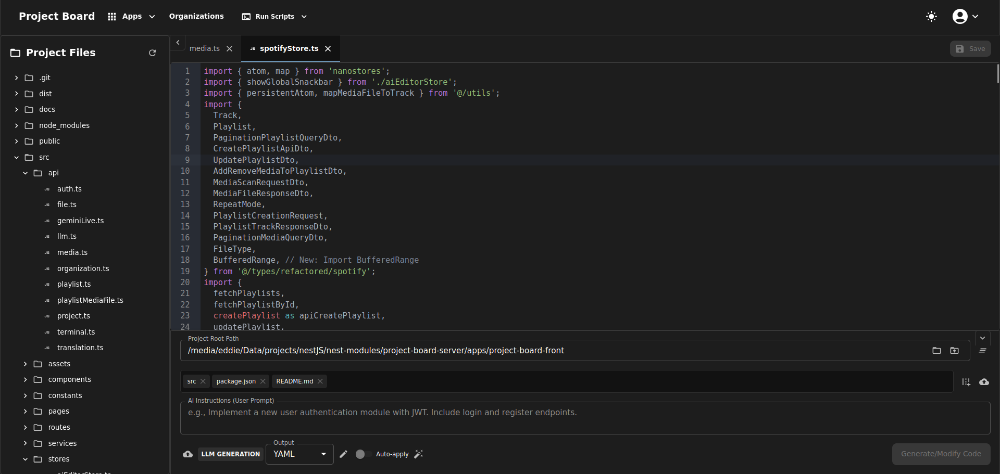
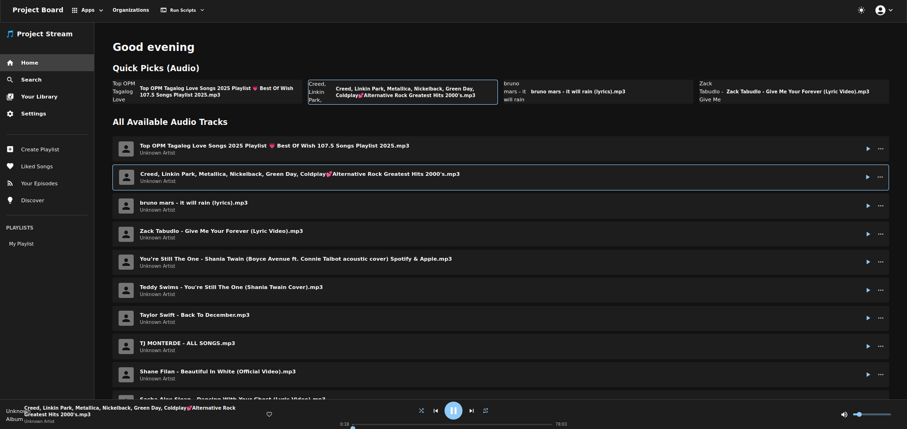
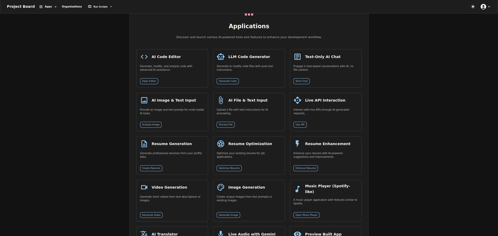

# 🚀 Project Board Frontend

[](https://github.com/evillan0315/ai-editor-front/LICENSE)
[](https://github.com/evillan0315/ai-editor-front/actions)
[](https://example.com/coverage)
[](https://github.com/evillan0315/ai-editor-front/commits)

> A React frontend for the Project Board server backend, built with **Vite**, React, Nanostores, Tailwind CSS, and Material UI, focusing on intelligent code assistance and a broader range of AI-powered applications. This application extensively leverages AI tools for development and project management.

---

## 📖 Table of Contents

- [📖 Table of Contents](#-table-of-contents)
- [🖼️ Screenshots](#️-screenshots)
- [▶️ Demo](#️-demo)
- [🏛️ High-Level Architecture](#️-high-level-architecture)
- [🗂️ Project Structure](#️-project-structure)
- [✨ Features](#-features)
- [✅ Requirements](#-requirements)
- [🛠️ Installation](#️-installation)
- [⚙️ Usage](#️-usage)
- [🔍 API Reference](#-api-reference)
- [🔑 Environment Variables](#-environment-variables)
- [🧪 Testing](#-testing)
- [📦 Deployment](#-deployment)
- [🌳 Git Workflow](#-git-workflow)
- [🗂️ Detailed Documentation](#️-detailed-documentation)
- [🚀 Core Technologies](#-core-technologies)
- [🤝 Contributing](#-contributing)
- [📜 License](#-license)
- [🙌 Acknowledgements](#-acknowledgements)
- [📧 Contact](#-contact)

---

## 🖼️ Screenshots







---

## ▶️ Demo

Watch a video demonstration of the project on YouTube:

[](https://youtu.be/js7CvamJwKM)

---

## 🏛️ High-Level Architecture


```mermaid
%%{init: {'theme': 'dark'}}%%
graph LR
 subgraph "Frontend (Client - React / Vite / TS / MUI / Tailwind)"
 Browser[User Browser]
 UI[React UI Components]
 Pages(Pages - HomePage, AppsPage, AiEditorPage, LoginPage, RegisterPage, SpotifyAppPage, TranslatorAppPage, GeminiLiveAudioPage, PreviewAppPage, OrganizationPage, ProjectsPage, ResumeBuilderPage etc.)
 State(Nanostores - aiEditorStore, authStore, fileTreeStore, themeStore, spotifyStore, translatorStore, geminiLiveStore, contextMenuStore, organizationStore, projectStore)
 Services(Frontend Services / API Clients)
 Router[React Router DOM]
 end

 subgraph "Backend (Server - NestJS / Node.js)"
 API[REST API Endpoints]
 Auth(Auth Service)
 LLM(LLM Orchestration Service)
 File(File System Service)
 Terminal(Terminal Execution Service)
 Translation(Translation Service)
 GeminiLive(Gemini Live WebSocket Gateway)
 Organization(Organization Service)
 Project(Project Service)
 DB[(Database)]
 AI_Provider[AI Provider &lpar;e.g., Gemini&rpar;]
 FS[Project File System]
 end

 Browser -- Renders --> UI
 UI -- User Input --> Pages
 Pages -- Actions / Data --> State
 State -- Updates --> UI
 State -- API Calls --> Services
 Services -- HTTP/S Requests --> API
 Services -- WebSocket --> GeminiLive
 API -- Delegates --> Auth
 API -- Delegates --> LLM
 API -- Delegates --> File
 API -- Delegates --> Terminal
 API -- Delegates --> Translation
 API -- Delegates --> Organization
 API -- Delegates --> Project
 Auth -- Reads/Writes --> DB
 LLM -- Requests/Responses --> AI_Provider
 Translation -- Requests/Responses --> AI_Provider
 GeminiLive -- WebSocket/Requests/Responses --> AI_Provider
 File -- Reads/Writes --> FS
 Terminal -- Executes --> FS
 Terminal -- Executes --> Shell(Shell Commands)
 API -- HTTP/S Responses --> Services
 Services -- Data --> State
 Router -- Navigates --> Pages

 style Frontend fill:#111,stroke:#333,stroke-width:2px;
 style Backend fill:#222,stroke:#333,stroke-width:2px;
 style State fill:#000,stroke:#333,stroke-width:1px;
 style Services fill:#000,stroke:#333,stroke-width:1px;
 style API fill:#000,stroke:#333,stroke-width:1px;
 linkStyle 0 stroke:#0a0,stroke-width:2px;
 linkStyle 1 stroke:#0a0,stroke-width:2px;
 linkStyle 2 stroke:#0a0,stroke-width:2px;
 linkStyle 3 stroke:#0a0,stroke-width:2px;
 linkStyle 4 stroke:#f60,stroke-width:2px;
 linkStyle 5 stroke:#f60,stroke-width:2px;
 linkStyle 6 stroke:#f60,stroke-width:2px;
 linkStyle 7 stroke:#f60,stroke-width:2px;
 linkStyle 8 stroke:#f60,stroke-width:2px;
 linkStyle 9 stroke:#f60,stroke-width:2px;
 linkStyle 10 stroke:#f60,stroke-width:2px;
 linkStyle 11 stroke:#f60,stroke-width:2px;
 linkStyle 12 stroke:#f60,stroke-width:2px;
 linkStyle 13 stroke:#f60,stroke-width:2px;
 linkStyle 14 stroke:#f60,stroke-width:2px;
 linkStyle 15 stroke:#f60,stroke-width:2px;
 linkStyle 16 stroke:#f60,stroke-width:2px;
 linkStyle 17 stroke:#f60,stroke-width:2px;
 linkStyle 18 stroke:#f60,stroke-width:2px;
 linkStyle 19 stroke:#f60,stroke-width:2px;
```

---

## 🗂️ Project Structure

```
project-board-front/
├── public/             # Static assets (e.g., vite.svg)
├── src/                # Source code for the React application
│   ├── api/            # API client functions for interacting with the backend (e.g., `auth.ts`, `file.ts`, `llm.ts`, `organization.ts`, `project.ts`, `terminal.ts`, `translation.ts`, `geminiLive.ts`, `conversation.ts`, `media.ts`, `playlist.ts`, `recording.ts`, `schema.ts`, etc., for operations like authentication, file management, LLM requests, project management, terminal commands, AI translation, and Gemini Live WebSocket communication)
│   ├── assets/         # Static assets like images/icons (e.g., react.svg)
│   ├── components/     # Reusable React components
│   │   ├── ai-tools/   # Components for AI prompt generation and interaction (e.g., `AIPromptGenerator.tsx`)
│   │   ├── board/      # Components for the Kanban board (`KanbanBoard.tsx`)
│   │   ├── code-generator/ # Core components for AI code generation, diffing, and applying changes (`ChangesList.tsx`, `PromptGenerator.tsx`, `CodeGeneratorMain.tsx`, `ChangeItem.tsx`, `GitInstructions.tsx`, `DocumentationViewer.tsx`, `ThoughtProcess.tsx`, `CodeRepair.tsx`)
│   │   │   ├── drawerContent/
│   │   │   │   ├── DirectoryPickerDrawer.tsx
│   │   │   │   ├── ImportJson.tsx
│   │   │   │   └── ScanPathsDrawer.tsx
│   │   ├── dialogs/    # Modal dialog components (e.g., `CreateFileOrFolderDialog.tsx`, `DirectoryPickerDialog.tsx`, `FileUploaderDialog.tsx`, `InstructionEditorDialog.tsx`, `OperationPathDialog.tsx`, `RenameDialog.tsx`, `ScanPathsDialog.tsx`, `TerminalSettingsDialog.tsx`, `index.ts` for exports)
│   │   ├── file-tree/  # Components for rendering and interacting with the project's file tree (`FileTree.tsx`, `FileTreeItem.tsx`, `FileTreeContextMenuRenderer.tsx`, `index.ts` for exports)
│   │   ├── git/        # **NEW: Co-located Git module components**
│   │   │   ├── api/
│   │   │   │   └── git.ts        # Git-related API calls
│   │   │   ├── stores/
│   │   │   │   └── gitStore.ts   # Git state management (Nanostore)
│   │   │   ├── types/
│   │   │   │   └── git.ts        # Git-related TypeScript type definitions
│   │   │   ├── GitBranchContextMenu.tsx
│   │   │   ├── GitBranchesSection.tsx
│   │   │   ├── GitCommitContextMenu.tsx
│   │   │   ├── GitDialogs.tsx
│   │   │   ├── GitDiffViewerDialog.tsx
│   │   │   ├── GitFileContextMenu.tsx
│   │   │   ├── GitPage.tsx       # Main Git UI page
│   │   │   ├── GitSnapshotContextMenu.tsx
│   │   │   ├── GitSnapshotsSection.tsx
│   │   │   └── GitStatusSection.tsx
│   │   ├── playwright/ # Components for Web Browser Automation with Playwright (`PlaywrightPage.tsx`, `PlaywrightControls.tsx`, `PlaywrightOutputDisplay.tsx`)
│   │   ├── resume/     # Components for the Resume Builder feature (`EducationTab.tsx`, `ExperienceTab.tsx`, `Header.tsx`, `PersonalInfoTab.tsx`, `ResumeDisplay.tsx`, `ResumeParserContainer.tsx`, `ResumePreview.tsx`, `ResumeUploadDialog.tsx`, `Sidebar.tsx`, `SkillsTab.tsx`, `TemplatesTab.tsx`, `index.ts` for exports)
│   │   ├── recording/  # Components for Screen Recording and Capture (`Recording.tsx`, `RecordingControls.tsx`, `RecordingsTable.tsx`)
│   │   ├── schema/     # Components for AI Schema generation and dynamic forms (`AiSchemaGenerator.tsx`, `DynamicFormBuilder.tsx`, `SchemaPropertiesEditor.tsx`)
│   │   ├── Terminal/   # Components for the integrated terminal (`Terminal.tsx`, `TerminalDialog.tsx`, `TerminalToolbar.tsx`)
│   │   ├── ui/         # Wrapper components for Material-UI elements (e.g., `Button.tsx`, `TextField.tsx`, `CircularProgress.tsx`)
│   │   └── ...         # Other general UI components (e.g., `AiResponseDisplay.tsx`, `AiSidebarContent.tsx`, `AppsMenuContent.tsx`, `Button.tsx`, `ConversationList.tsx`, `FilePickerDialog.tsx`, `FileTabs.tsx`, `Html5VideoPlayer.tsx`, `InitialEditorViewer.tsx`, `Layout.tsx`, `LlmGenerationContent.tsx`, `Loading.tsx`, `Navbar.tsx`, `OpenedFileViewer.tsx`, `OutputLogger.tsx`, `ProfileMenuContent.tsx`, `PromptGenerator.tsx`, `ProposedChangeCard.tsx`, `RunScriptMenuItem.tsx`, `Snackbar.tsx`, `ThemeToggle.tsx`, `TranscriptionPlayer/`, `VideoModal.tsx`, `WelcomeMessage.tsx`, `CodeMirror/`)
│   ├── constants/      # Global constants, default AI instruction templates, and configuration values (e.g., `fileIcons.tsx`, `requestTypeIcons.ts`, `scriptIcons.ts`, `appDefinitions.ts`, `markdown-instruction.ts`, `text-instruction.ts`, `yaml-instruction.ts`, `transcription.ts`, `index.ts` for exports)
│   ├── hooks/          # Custom React hooks for reusable logic
│   ├── pages/          # Top-level page components, defining the main views of the application
│   │   ├── spotify/    # Components specific to the Spotify-like app (e.g., `AddMediaToPlaylistDialog.tsx`, `MediaActionMenu.tsx`, `SpotifyHomePage.tsx`, `SpotifyLibraryPage.tsx`, `SpotifyMainContent.tsx`, `SpotifyPlayerBar.tsx`, `SpotifySearchPage.tsx`, `SpotifySettingsPage.tsx`, `SpotifySidebar.tsx`, `VideoPlayer.tsx`, `index.ts` for exports)
│   │   └── ...         # Other pages (e.g., `AIChatPage.tsx`, `AiEditorPage.tsx`, `AppsPage.tsx`, `AuthCallback.tsx`, `DashboardPage.tsx`, `GeminiLiveAudioPage.tsx`, `HomePage.tsx`, `KanbanBoardPage.tsx`, `LlmGenerationPage.tsx`, `LoginPage.tsx`, `OrganizationPage.tsx`, `PreviewAppPage.tsx`, `ProjectsPage.tsx`, `RecordingPage.tsx`, `RegisterPage.tsx`, `ResumeBuilderPage.tsx`, `SchemeGeneratorPage.tsx`, `SpotifyAppPage.tsx`, `TerminalPage.tsx`, `TranscriptionPage.tsx`, `TranslatorAppPage.tsx`, `UserProfilePage.tsx`, `UserSettingsPage.tsx`)
│   ├── services/       # Business logic for API calls, authentication state management, and other non-UI related operations (e.g., `authService.ts`, `socketService.ts`)
│   ├── stores/         # Nanostores for centralized, reactive global state management (e.g., `aiChatStore.ts`, `aiEditorStore.ts`, `appPreviewStore.ts`, `authStore.ts`, `configStore.ts`, `contextMenuStore.ts`, `conversationStore.ts`, `errorStore.ts`, `fileStore.ts`, `fileTreeStore.ts`, `geminiLiveStore.ts`, `llmStore.ts`, `loadingStore.ts`, `logStore.ts`, `mediaStore.ts`, `navbarAppsStore.ts`, `organizationStore.ts`, `projectStore.ts`, `recordingStore.ts`, `schemaStore.ts`, `scriptStore.ts`, `snackbarStore.ts`, `spotifyStore.ts`, `terminalStore.ts`, `themeStore.ts`, `translatorStore.ts`, `uiStore.ts`)
│   ├── theme/          # Custom Material UI theme configurations
│   ├── types/          # TypeScript type definitions for API responses, application state, and domain models (e.g., `ai.ts`, `app.ts`, `auth.ts`, `conversation.ts`, `file.ts`, `gemini.ts`, `index.ts`, `llm.ts`, `main.ts`, `preview.ts`, `project.ts`, `recording.ts`, `refactored/`, `resume.ts`, `schema.ts`, `terminal.ts`, `user.ts`)
│   └── utils/          # General utility functions (e.g., `codemirrorTheme.ts`, `debounce.ts`, `diffLanguage.ts`, `fileUtils.ts`, `index.ts`, `mediaUtils.ts`, `persistentAtom.ts`)
├── .env                # Environment variables (local overrides for development, not committed)
├── .env.local          # Local environment variables (sensitive data, not committed to VCS)
├── docs/
│   ├── ARCHITECTURE.md # High-level architectural overview.
│   ├── COMPONENTS.md   # Details on React components.
│   ├── fix_spotify.json
│   ├── llm-schema.json
│   ├── project-management-schema.json
│   ├── schema/
│   │   ├── developer/
│   │   │   ├── DYNAMIC_FORM_BUILDER.md # Documentation on dynamic form builder for developers.
│   │   │   ├── llm-schema.json
│   │   │   ├── project-management-schema.json
│   │   │   └── SCHEMA_GENERATION_AND_EDITING.md # Documentation on schema generation and editing.
│   │   └── user/
│   │       └── USING_DYNAMIC_FORMS.md # User guide for dynamic forms.
│   └── STATE_MANAGEMENT.md # Information on state management strategy.
├── ecosystem.config.cjs # PM2 process file
├── eslint.config.ts    # ESLint configuration for code quality and style
├── index.html          # Main HTML entry point for the single-page application
├── package.json        # Project dependencies, scripts, and metadata
├── README.md           # Project documentation (this file)
├── tsconfig.app.json   # TypeScript configuration for the React application
├── tsconfig.json       # TypeScript configuration for the project
├── tsconfig.node.json  # TypeScript configuration for Node.js related files
└── vite.config.ts      # Vite build configuration, including proxy setup for API calls
```

For deeper understanding of the project architecture, components and state management, see the documentation files in the `/docs` directory:

- [Architecture Overview](docs/ARCHITECTURE.md)
- [Component Details](docs/COMPONENTS.md)
- [State Management](docs/STATE_MANAGEMENT.md)
- [Dynamic Form Builder for Developers](docs/schema/developer/DYNAMIC_FORM_BUILDER.md)
- [Schema Generation and Editing](docs/schema/developer/SCHEMA_GENERATION_AND_EDITING.md)
- [Using Dynamic Forms (User Guide)](docs/schema/user/USING_DYNAMIC_FORMS.md)

---

## ✨ Features

- 🤖 **AI-Powered Code Generation & Modification**: Interact with a powerful AI to generate new files, modify existing ones, repair code, or delete files based on natural language instructions. Supports advanced `CODE_GENERATION`, `CODE_MODIFICATION`, `CODE_REPAIR`, and `CODE_ANALYSIS` request types.
- 💡 **Interactive Proposed Changes**: View AI's proposed changes with detailed file paths, action types (ADD, MODIFY, DELETE, REPAIR, ANALYZE), and AI-generated reasons. Selectively apply or discard individual changes, and even edit the proposed content before application.
- 📊 **Git Diff Visualization**: Inspect detailed git diffs for proposed modifications and deletions directly within the editor before applying changes, ensuring transparency and control.
- 🏃 **Direct Terminal Command Execution**: Execute AI-generated `git` instructions (e.g., `git add .`, `git commit`) directly from the UI, with immediate display of terminal output and errors. Also, run project-specific `npm`, `yarn`, or `pnpm` scripts directly from the Navbar.
- 🔒 **Secure Authentication**: Seamlessly log in using Google or GitHub OAuth2, or with standard email/password, for secure access to the editor, with user session management handled by the backend.
- 📂 **Project Context & Scanning**: Specify a project root path and relevant scan paths for the AI to analyze, providing crucial context for intelligent code suggestions and understanding project structure. Includes an interactive file picker dialog for easy path selection and an interactive directory picker dialog for choosing the project root.
- 🚀 **File Tree Navigation & Content Viewing with Tabs**: Browse your project's file structure with an interactive file tree. Open multiple files into tabs, switch between them, and view/edit their content in a dedicated editor panel. You can manually edit the content of proposed AI changes, and the file viewer remains editable when AI responses are active to allow for manual adjustments alongside AI suggestions.
- 📝 **Integrated CodeMirror Editor**: Leverage the powerful CodeMirror 6 editor for file viewing and editing, offering syntax highlighting and a robust editing experience within the AI-driven environment.
- ⬆️ **File/Image Upload for AI Context**: Upload files or paste Base64 data (e.g., images, text files) to provide additional context to the AI, enabling multi-modal requests (`TEXT_WITH_IMAGE`, `TEXT_WITH_FILE` request types).
- 📝 **Customizable AI Instructions & Output Format**: Modify the underlying AI system instructions, the expected output JSON schema, YAML, Markdown, or plain text format directly within the UI, allowing for fine-tuned control over AI behavior.
- ⚙️ **Selectable AI Request Types**: Choose between various request types including `TEXT_ONLY`, `TEXT_WITH_IMAGE`, `TEXT_WITH_FILE`, `LLM_GENERATION` (general AI generation), `LIVE_API` (for real-time interactions), `RESUME_GENERATION`, `RESUME_OPTIMIZATION`, `RESUME_ENHANCEMENT`, `VIDEO_GENERATION`, `IMAGE_GENERATION`, `CODE_GENERATION`, `CODE_MODIFICATION`, `CODE_REPAIR`, and `CODE_ANALYSIS` to optimize AI interaction based on your input and desired outcome.
- ⚡ **Auto-Apply Proposed Changes**: Option to automatically apply AI-generated changes to the file system immediately after generation, streamlining repetitive tasks.
- 💬 **AI Chat Page**: A dedicated interface for general AI conversational interactions and querying.
- 🎵 **Spotify-like Music Player**: An integrated application for a simulated music streaming experience.
- 🌐 **AI Translator App**: Translate text content or uploaded files into any language using AI.
- 🎙️ **Gemini Live Audio Chat**: Interact with Gemini AI using real-time audio input and output for conversational experiences.
- 📦 **Built Application Preview**: Embed and view a successfully built frontend application via a configurable URL in an iframe directly within the editor.
- 🌍 **Project Management**: Create and manage organizations and their associated projects, with a Kanban board for task visualization and progress tracking.
- 📜 **AI Schema Generator & Dynamic Forms**: Generate and validate JSON schemas based on natural language descriptions, which can then be used to dynamically build UI forms and interfaces.
- 🗂️ **Resume Builder**: Build and export resumes using AI and custom templates, with capabilities to parse, display, and optimize content.
- ⏺️ **Screen Recording**: Capture your screen, record videos, and take screenshots directly within the application.
- 🕸️ **Web Browser Automation (Playwright)**: Control and interact with web pages using AI-generated Playwright scripts directly within the application, enabling automated testing, scraping, and task execution.
- 🌗 **Dark/Light Theme Toggle**: Effortlessly switch between dark and light modes, enhancing readability and user comfort.

---

## ✅ Requirements

- Node.js >= 18
- [Project Board Backend](https://github.com/evillan0315/project-board-server) (running and accessible via `VITE_API_URL` and `VITE_WS_URL`)

---

## 🛠️ Installation

```bash
# Navigate to the project root (project-board-front)
cd project-board-front

# Install dependencies
pnpm install # or npm install / yarn install
```

---

## ⚙️ Usage

```bash
# Development server (runs on port 3001 by default)
pnpm run dev

# Build for production
pnpm run build

# Start production build (requires a build first)
pnpm run preview
```

---

## 🔍 API Reference

This frontend interacts with the Project Board backend. Key endpoints and WebSocket services include:

-   **`/api/auth/google`, `/api/auth/github`**: For OAuth2 authentication.
-   **`/api/auth/login`, `/api/auth/register`**: For local email/password authentication.
-   **`/api/auth/me`**: To check user session status.
-   **`/api/llm/generate-llm`**: To send user prompts and receive AI-generated code changes or multi-modal responses.
-   **`/api/llm/report-error`**: To report frontend execution errors (e.g., build failures, git command errors) back to the LLM backend for feedback and improvement.
-   **`/api/file/scan`**: To fetch project file structure for AI context.
-   **`/api/file/list`**: To fetch directory contents for the interactive file tree.
-   **`/api/file/open`**: To read the content of a specific file.
-   **`/api/file/create`**: To create new files or folders.
-   **`/api/file/delete`**: To delete files or folders.
-   **`/api/file/rename`**: To rename files or folders.
-   **`/api/file/copy`**: To copy files or folders.
-   **`/api/file/move`**: To move files or folders.
-   **`/api/file/apply-changes`**: To apply selected AI-proposed file modifications to the file system.
-   **`/api/file/git-diff`**: To retrieve git diffs for proposed modifications and deletions directly within the editor before applying changes, ensuring transparency and control.
-   **`/api/terminal/run`**: To execute arbitrary shell commands on the backend (e.g., for `git` operations or project scripts).
-   **`/api/terminal/package-scripts`**: To fetch `package.json` scripts and detect the project's package manager.
-   **`/api/playwright/run`**: To execute AI-generated Playwright scripts for web browser automation.
-   **`/api/utils/json-yaml/to-json`**: To convert YAML content to JSON.
-   **`/api/translation/translate`**: To translate text or files using AI.
-   **`/api/organization`**: CRUD operations for organizations.
-   **`/api/project`**: CRUD operations for projects, linked to organizations.
-   **`/api/schema/generate`**: To generate JSON schemas from natural language prompts.
-   **`/media`**: To download extracted audio/video files and other media resources.
-   **`/recording`**: To access screen recording and screenshot captures.
-   **`/gemini` (WebSocket)**: For real-time Gemini Live Audio interactions (starting sessions, sending audio, receiving AI responses).

Please refer to the backend documentation for detailed API schemas and additional endpoints for authentication, AI generation, and file/terminal operations.

---

## 🔑 Environment Variables

Create a `.env` file in the root directory of `project-board-front`. **Do not commit `.env.local` to version control.**

```env
VITE_API_URL=http://localhost:3000          # The URL of your Project Board backend REST API
VITE_WS_URL=ws://localhost:3000             # The URL of your Project Board backend WebSocket server (for Gemini Live Audio)
VITE_FRONTEND_URL=http://localhost:3001     # The URL where your frontend is hosted (e.g., for OAuth redirects from backend)
VITE_BASE_DIR=/path/to/your/project/root    # **Optional**: Default project root to pre-fill in the editor's project path input. Can be overridden in the UI. If not set, the user must provide one. This variable is useful for local development to avoid repeatedly typing the project path.
VITE_PREVIEW_APP_URL=http://localhost:8080  # **Optional**: URL of a built frontend application to preview in an iframe. e.g., points to a server serving /media/eddie/Data/projects/nestJS/nest-modules/project-board-server/apps/project-board-front/dist
```

---

## 🧪 Testing

Currently, testing is an area for future development. The project uses basic `npm test` scripts, but a comprehensive testing framework (e.g., Vitest, React Testing Library, Playwright) is planned for integration to ensure robustness and reliability.

```bash
# Run all tests (currently placeholder, update as testing framework is integrated)
npm test

# With coverage
npm run test:coverage
```

---

## 📦 Deployment

-   **Vercel**
    [](https://vercel.com/import/project?template=https://github.com/evillan0315/project-board-front)

---

## 🌳 Git Workflow

This section outlines a basic Git workflow for contributing to the project. Always ensure your local repository is up-to-date and your changes are properly committed.

### 👯‍♀️ Branching Strategy

We recommend a feature-branch workflow. All new features, bug fixes, or improvements should be developed on a dedicated branch created from `main` (or `develop` if applicable).

1.  **Update your local `main` branch:**

```bash
git checkout main
git pull origin main
```

2.  **Create a new feature branch:**

```bash
git checkout -b feature/your-feature-name
# or for bug fixes:
git checkout -b bugfix/issue-description
```

### 📝 Making Changes and Committing

As you make changes, frequently stage and commit your work with clear, concise messages.

1.  **Check your current changes:**

```bash
git status
```

2.  **Stage your changes (add files to the staging area):**

```bash
git add .
# or to add specific files:
git add src/path/to/your/file.ts src/other/file.tsx
```

3.  **Commit your staged changes:**

```bash
git commit -m 'feat: Add new user authentication component'
# or for a bug fix:
git commit -m 'fix: Resolve navigation issue in Navbar'
# Use imperative mood, start with type (feat, fix, docs, chore, style, refactor, test, build, ci, perf)
```

4.  **Push your branch to the remote repository:**

```bash
git push origin feature/your-feature-name
```

### 🚀 Submitting a Pull Request (PR)

Once your feature branch is ready and pushed, you can open a Pull Request.

1.  **Ensure your branch is up-to-date with `main`:**

```bash
git checkout feature/your-feature-name
git pull origin main # This will pull changes from main into your branch. Resolve any conflicts.
git push origin feature/your-feature-name
```

2.  **Go to the GitHub repository and open a new Pull Request** from your feature branch to the `main` branch.

3.  **Provide a clear title and description** for your PR, referencing any related issues.

---

## 🗂️ Detailed Documentation

For deeper understanding of the project architecture, components and state management, see the documentation files in the `/docs` directory:

- [Architecture Overview](docs/ARCHITECTURE.md)
- [Component Details](docs/COMPONENTS.md)
- [State Management](docs/STATE_MANAGEMENT.md)
- [Dynamic Form Builder for Developers](docs/schema/developer/DYNAMIC_FORM_BUILDER.md)
- [Schema Generation and Editing](docs/schema/developer/SCHEMA_GENERATION_AND_EDITING.md)
- [Using Dynamic Forms (User Guide)](docs/schema/user/USING_DYNAMIC_FORMS.md)

---

## 🚀 Core Technologies

This project is built using a modern frontend stack designed for performance, scalability, and developer experience:

-   **React 19**: A declarative, component-based JavaScript library for building user interfaces.
-   **Vite 5**: A fast development build tool that significantly improves frontend development speed.
-   **TypeScript 5.x**: A superset of JavaScript that adds static types, enhancing code quality and maintainability.
-   **Material UI v6**: A comprehensive suite of UI tools and components for building beautiful and accessible React applications.
-   **Tailwind CSS v4**: A utility-first CSS framework for rapidly building custom designs.
-   **Nanostores**: A tiny, fast, and modern state management library for React.
-   **CodeMirror 6**: A versatile text editor implemented in JavaScript for the browser, used for file viewing and editing within the application.
-   **Socket.IO Client**: Enables real-time, bidirectional, event-based communication between the client and server.
-   **Axios**: A promise-based HTTP client for making API requests.
-   **React Router DOM 7**: Declarative routing for React applications.
-   **ESLint (Flat Config)**: A pluggable linting utility for JavaScript and TypeScript, configured with a modern flat configuration approach.
-   **Prettier**: An opinionated code formatter that enforces a consistent style.

---

## 🤝 Contributing

Contributions are welcome!
Please read [CONTRIBUTING.md](https://github.com/evillan0315/project-board-front/blob/main/CONTRIBUTING.md) for details.

---

## 📜 License

Distributed under the MIT License. See [LICENSE](https://github.com/evillan0315/project-board-front/blob/main/LICENSE) for more information.

---

## 🙌 Acknowledgements

-   [@uiw/react-codemirror](https://uiwjs.github.io/react-codemirror/)
-   [path-browserify](https://www.npmjs.com/package/path-browserify)
-   [github-markdown-css](https://github.com/sindresorhus/github-markdown-css)
-   [remark-gfm](https://github.com/remarkjs/remark-gfm)
-   [rehype-highlight](https://github.com/rehypejs/rehype-highlight)
-   [rehype-raw](https://github.com/rehypejs/rehype-raw)
-   [rehype-sanitize](https://github.com/rehypejs/rehype-sanitize)

---

## 📧 Contact

Eddie Villanueva - [evillan0315@gmail.com](mailto:evillan0315@gmail.com)
[LinkedIn](https://www.linkedin.com/in/eddie-villalon/)
[GitHub](https://github.com/evillan0315)