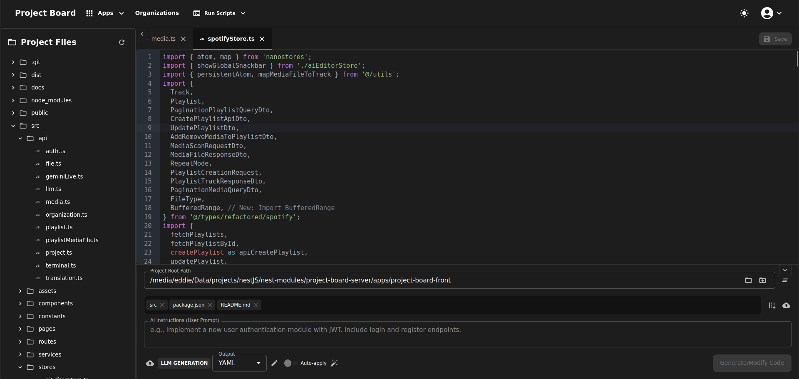

# 🚀 Project Board Frontend

[](LICENSE)
[](https://github.com/evillan0315/project-board-front/issues)
[](https://github.com/evillan0315/project-board-front/pulls)
[](https://github.com/evillan0315/project-board-front/commits)

> A React frontend for the Project Board server backend, built with **Vite**, React, Nanostores, Tailwind CSS, and Material UI, focusing on intelligent code assistance and a broader range of AI-powered applications.

---

## 📖 Table of Contents

- [Features](#-features)
- [High-Level Architecture](#-high-level-architecture)
- [Project Structure](#-project-structure)
- [Requirements](#-requirements)
- [Installation](#-installation)
- [Usage](#-usage)
- [API Reference](#-api-reference)
- [Environment Variables](#-environment-variables)
- [Testing](#-testing)
- [Deployment](#-deployment)
- [Git Workflow](#-git-workflow)
- [Resume Builder](#resume-builder)
- [Screen Recording](#screen-recording)
- [Roadmap](#-roadmap)
- [Contributing](#-contributing)
- [License](#-license)
- [Acknowledgements](#-acknowledgements)
- [Contact](#-contact)

---

## ✨ Features

- 🤖 **AI-Powered Code Generation & Modification**: Interact with a powerful AI to generate new files, modify existing ones, repair code, or delete files based on natural language instructions.
- 💡 **Interactive Proposed Changes**: View AI's proposed changes with detailed file paths, action types (ADD, MODIFY, DELETE, REPAIR, ANALYZE), and AI-generated reasons. Selectively apply or discard individual changes, and even edit the proposed content before application.
- 📊 **Git Diff Visualization**: Inspect detailed git diffs for proposed modifications and deletions directly within the editor before applying changes, ensuring transparency and control.
- 🏃 **Direct Terminal Command Execution**: Execute AI-generated `git` instructions (e.g., `git add .`, `git commit`) directly from the UI, with immediate display of terminal output and errors. Also, run project-specific `npm`, `yarn`, or `pnpm` scripts directly from the Navbar.
- 🔒 **Secure Authentication**: Seamlessly log in using Google or GitHub OAuth2, or with standard email/password, for secure access to the editor, with user session management handled by the backend.
- 📂 **Project Context & Scanning**: Specify a project root path and relevant scan paths for the AI to analyze, providing crucial context for intelligent code suggestions and understanding project structure. Includes an interactive file picker dialog for easy path selection and an interactive directory picker dialog for choosing the project root.
- 🚀 **File Tree Navigation & Content Viewing with Tabs**: Browse your project's file structure with an interactive file tree. Open multiple files into tabs, switch between them, and view/edit their content in a dedicated editor panel. You can manually edit the content of proposed AI changes, and the file viewer remains editable when AI responses are active to allow for manual adjustments alongside AI suggestions.
- ⬆️ **File/Image Upload for AI Context**: Upload files or paste Base64 data (e.g., images, text files) to provide additional context to the AI, enabling multi-modal requests.
- 📝 **Customizable AI Instructions & Output Format**: Modify the underlying AI system instructions, the expected output JSON schema, YAML, Markdown, or plain text format directly within the UI, allowing for fine-tuned control over AI behavior.
- ⚙️ **Selectable AI Request Types**: Choose between various request types (e.g., `TEXT_ONLY`, `TEXT_WITH_IMAGE`, `TEXT_WITH_FILE`, `LLM_GENERATION`, `LIVE_API`, `RESUME_GENERATION`, `VIDEO_GENERATION`, `IMAGE_GENERATION`, `RESUME_OPTIMIZATION`, `RESUME_ENHANCEMENT`, etc.) to optimize AI interaction based on your input and desired outcome.
- ⚡ **Auto-Apply Proposed Changes**: Option to automatically apply AI-generated changes to the file system immediately after generation, streamlining repetitive tasks.
- 🎵 **Spotify-like Music Player**: An integrated application for a simulated music streaming experience.
- 🌐 **AI Translator App**: Translate text content or uploaded files into any language using AI.
- 🎙️ **Gemini Live Audio Chat**: Interact with Gemini AI using real-time audio input and output for conversational experiences.
- 📦 **Built Application Preview**: Preview a successfully built frontend application by embedding it via a configurable URL in an iframe.
- 🌍 **Project Management**: Create and manage organizations and their associated projects.
- ⚙️ **Project Settings**: Manage project configurations, AI models, and API keys. (Coming Soon)
- 🐛 **Bug Report**: Submit bug reports and track issues within your projects. (Coming Soon)
- 🌍 **Modern UI/UX**: Built with React, Material-UI, and Tailwind CSS for a responsive, accessible, and intuitive user experience.
- ⚡ **Vite Development**: Fast development and build times powered by Vite, providing a modern and efficient development workflow.
- 🌗 **Dark/Light Theme Toggle**: Effortlessly switch between dark and light modes, enhancing readability and user comfort.
- 🗂️ **Resume Builder**: Build and export resumes using AI and custom templates.
- ⏺️ **Screen Recording**: Capture your screen, record videos, and take screenshots directly within the application.

---

## 🖼️ Screenshots




---

## 🗺️ High-Level Architecture


---

## 📂 Project Structure

```bash
project-board-front/
├── public/             # Static assets (e.g., vite.svg)
├── src/                # Source code for the React application
│   ├── api/            # API client functions for interacting with the backend (e.g., `auth.ts`, `file.ts`, `llm.ts`, `organization.ts`, `project.ts`, `terminal.ts`, `translation.ts`, `geminiLive.ts` for operations like authentication, file management, LLM requests, project management, terminal commands, AI translation, and Gemini Live WebSocket communication)
│   ├── assets/         # Static assets like images/icons (e.g., react.svg)
│   ├── components/     # Reusable React components
│   │   ├── dialogs/    # Modal dialog components (e.g., `CreateFileOrFolderDialog.tsx`, `DirectoryPickerDialog.tsx`, `FileUploaderDialog.tsx`, `InstructionEditorDialog.tsx`, `OperationPathDialog.tsx`, `RenameDialog.tsx`, `TerminalSettingsDialog.tsx`, `index.ts` for exports)
│   │   ├── file-tree/  # Components for rendering and interacting with the project's file tree (`FileTree.tsx`, `FileTreeItem.tsx`, `FileTreeContextMenuRenderer.tsx`, `index.ts` for exports)
│   │   ├── resume/     # Components for the Resume Builder feature (`EducationTab.tsx`, `ExperienceTab.tsx`, `Header.tsx`, `PersonalInfoTab.tsx`, `ResumeDisplay.tsx`, `ResumeParserContainer.tsx`, `ResumePreview.tsx`, `ResumeUploadDialog.tsx`, `Sidebar.tsx`, `SkillsTab.tsx`, `TemplatesTab.tsx`, `index.ts` for exports)
│   │   ├── ui/         # Wrapper components for Material-UI elements (e.g., `Button.tsx`, `TextField.tsx`, `CircularProgress.tsx`)
│   │   └── ...         # Other general UI components (e.g., `AiResponseDisplay.tsx`, `AiSidebarContent.tsx`, `AppsMenuContent.tsx`, `Button.tsx`, `ConversationList.tsx`, `FilePickerDialog.tsx`, `FileTabs.tsx`, `Html5VideoPlayer.tsx`, `InitialEditorViewer.tsx`, `Layout.tsx`, `LlmGenerationContent.tsx`, `Loading.tsx`, `Navbar.tsx`, `OpenedFileViewer.tsx`, `OutputLogger.tsx`, `ProfileMenuContent.tsx`, `PromptGenerator.tsx`, `ProposedChangeCard.tsx`, `resume/`, `RunScriptMenuItem.tsx`, `Snackbar.tsx`, `Terminal/`, `ThemeToggle.tsx`, `TranscriptionPlayer/`, `VideoModal.tsx`, `WelcomeMessage.tsx`, `CodeMirror/`)
│   ├── constants/      # Global constants, default AI instruction templates, and configuration values (e.g., `fileIcons.tsx`, `requestTypeIcons.ts`, `scriptIcons.ts`, `appDefinitions.ts`, `markdown-instruction.ts`, `text-instruction.ts`, `yaml-instruction.ts`, `transcription.ts`, `index.ts` for exports)
│   ├── hooks/          # Custom React hooks for reusable logic
│   ├── pages/          # Top-level page components, defining the main views of the application
│   │   ├── spotify/    # Components specific to the Spotify-like app (e.g., `AddMediaToPlaylistDialog.tsx`, `MediaActionMenu.tsx`, `SpotifyHomePage.tsx`, `SpotifyLibraryPage.tsx`, `SpotifyMainContent.tsx`, `SpotifyPlayerBar.tsx`, `SpotifySearchPage.tsx`, `SpotifySettingsPage.tsx`, `SpotifySidebar.tsx`, `VideoPlayer.tsx`, `index.ts` for exports)
│   │   └── ...         # Other pages (e.g., `AiEditorPage.tsx`, `AppsPage.tsx`, `AuthCallback.tsx`, `DashboardPage.tsx`, `GeminiLiveAudioPage.tsx`, `HomePage.tsx`, `LlmGenerationPage.tsx`, `LoginPage.tsx`, `OrganizationPage.tsx`, `PreviewAppPage.tsx`, `ProjectsPage.tsx`, `RegisterPage.tsx`, `ResumeBuilderPage.tsx`, `SpotifyAppPage.tsx`, `TerminalPage.tsx`, `TranscriptionPage.tsx`, `TranslatorAppPage.tsx`, `UserProfilePage.tsx`, `UserSettingsPage.tsx`)
│   ├── routes/         # Application routing setup (currently defined in `index.tsx` using React Router DOM)
│   ├── services/       # Business logic for API calls, authentication state management, and other non-UI related operations (e.g., `authService.ts`, `socketService.ts`)
│   ├── stores/         # Nanostores for centralized, reactive global state management (e.g., `aiEditorStore.ts`, `authStore.ts`, `contextMenuStore.ts`, `conversationStore.ts`, `fileTreeStore.ts`, `geminiLiveStore.ts`, `logStore.ts`, `organizationStore.ts`, `projectStore.ts`, `spotifyStore.ts`, `terminalStore.ts`, `themeStore.ts`, `translatorStore.ts`)
│   ├── theme/          # Custom Material UI theme configurations
│   ├── types/          # TypeScript type definitions for API responses, application state, and domain models (e.g., `auth.ts`, `conversation.ts`, `index.ts`, `project.ts`, `resume.ts`, `terminal.ts`, `refactored/`)
│   └── utils/          # General utility functions (e.g., `codemirrorTheme.ts`, `diffLanguage.ts`, `fileUtils.ts`, `index.ts`, `mediaUtils.ts`, `persistentAtom.ts`)
├── .env                # Environment variables (local overrides for development, not committed)
├── .env.local          # Local environment variables (sensitive data, not committed to VCS)
├── docs/               # Project documentation files (e.g., ARCHITECTURE.md, COMPONENTS.md, STATE_MANAGEMENT.md)
├── ecosystem.config.cjs # PM2 process file
├── eslint.config.ts    # ESLint configuration for code quality and style
├── index.html          # Main HTML entry point for the single-page application
├── package.json        # Project dependencies, scripts, and metadata
├── README.md           # Project documentation (this file)
├── tsconfig.app.json   # TypeScript configuration for the React application
├── tsconfig.json       # TypeScript configuration for the project
├── tsconfig.node.json  # TypeScript configuration for Node.js related files
└── vite.config.ts      # Vite build configuration, including proxy setup for API calls

```
---

## 📋 Requirements

- Node.js >= 18
- Project Board Backend (running and accessible via `VITE_API_URL` and `VITE_WS_URL`)

---

## 🛠️ Installation

```bash
# Navigate to the project root (project-board-front)
cd project-board-front

# Install dependencies
pnpm install # or npm install / yarn install

```
---

## ⚙️ Usage

```bash
# Development server (runs on port 3001 by default)
pnpm run dev

# Build for production
pnpm run build

# Start production build (requires a build first)
pnpm run preview
```

---

## 📖 API Reference

This frontend interacts with the Project Board backend. Key endpoints and WebSocket services include:

- **`/api/auth/google`, `/api/auth/github`**: For OAuth2 authentication.
- **`/api/auth/login`, `/api/auth/register`**: For local email/password authentication.
- **`/api/auth/me`**: To check user session status.
- **`/api/llm/generate-llm`**: To send user prompts and receive AI-generated code changes or multi-modal responses.
- **`/api/file/scan`**: To fetch project file structure for AI context.
- **`/api/file/list`**: To fetch directory contents for the interactive file tree.
- **`/api/file/open`**: To read the content of a specific file.
- **`/api/file/apply-changes`**: To apply selected AI-proposed file modifications to the file system.
- **`/api/file/git-diff`**: To retrieve git diffs for proposed changes against the current working tree.
- **`/api/terminal/run`**: To execute arbitrary shell commands on the backend (e.g., for `git` operations or project scripts).
- **`/api/terminal/package-scripts`**: To fetch package.json scripts and detect package manager.
- **`/api/utils/json-yaml/to-json`**: To convert YAML content to JSON.
- **`/api/translation/translate`**: To translate text or files using AI.
- **`/api/organization`**: CRUD operations for organizations.
- **`/api/project`**: CRUD operations for projects, linked to organizations.
- **`/gemini` (WebSocket)**: For real-time Gemini Live Audio interactions (starting sessions, sending audio, receiving AI responses).

Please refer to the backend documentation for detailed API schemas and additional endpoints for authentication, AI generation, and file/terminal operations.

---

## 🔑 Environment Variables

Create a `.env` file in the root directory of `project-board-front`. **Do not commit `.env.local` to version control.**

```ini
VITE_API_URL=http://localhost:3000          # The URL of your Project Board backend REST API
VITE_WS_URL=ws://localhost:3000             # The URL of your Project Board backend WebSocket server (for Gemini Live Audio)
VITE_FRONTEND_URL=http://localhost:3001     # The URL where your frontend is hosted (e.g., for OAuth redirects from backend)
VITE_BASE_DIR=/path/to/your/project/root    # **Optional**: Default project root to pre-fill in the editor's project path input. Can be overridden in the UI. If not set, the user must provide one. This variable is useful for local development to avoid repeatedly typing the project path.
VITE_PREVIEW_APP_URL=http://localhost:8080  # **Optional**: URL of a built frontend application to preview in an iframe. e.g., points to a server serving /media/eddie/Data/projects/nestJS/nest-modules/project-board-server/apps/project-board-front/dist
```

---

## 🧪 Testing

```bash
# Run all tests (currently placeholder, update as testing framework is integrated)
npm test

# With coverage
npm run test:coverage

```
---

## 📦 Deployment

- **Vercel**
  [](https://vercel.com/import/project?template=https://github.com/evillan0315/project-board-front)

---

## 🌳 Git Workflow

This section outlines a basic Git workflow for contributing to the project. Always ensure your local repository is up-to-date and your changes are properly committed.

### 👯‍♀️ Branching Strategy

We recommend a feature-branch workflow. All new features, bug fixes, or improvements should be developed on a dedicated branch created from `main` (or `develop` if applicable).

1.  **Update your local `main` branch:**

    ```bash
    git checkout main
    git pull origin main
    ```

2.  **Create a new feature branch:**
    ```bash
git checkout -b feature/your-feature-name
    # or for bug fixes:
    git checkout -b bugfix/issue-description
    ```

### 📝 Making Changes and Committing

As you make changes, frequently stage and commit your work with clear, concise messages.

1.  **Check your current changes:**

    ```bash
    git status
    ```

2.  **Stage your changes (add files to the staging area):**

    ```bash
    git add .
    # or to add specific files:
    git add src/path/to/your/file.ts src/other/file.tsx
    ```

3.  **Commit your staged changes:**

    ```bash
    git commit -m "feat: Add new user authentication component"
    # or for a bug fix:
    git commit -m "fix: Resolve navigation issue in Navbar"
    # Use imperative mood, start with type (feat, fix, docs, chore, style, refactor, test, build, ci, perf)
    ```

4.  **Push your branch to the remote repository:**
    ```bash
git push origin feature/your-feature-name
    

### 🚀 Submitting a Pull Request (PR)

Once your feature branch is ready and pushed, you can open a Pull Request.

1.  **Ensure your branch is up-to-date with `main`:**

    ```bash
    git checkout feature/your-feature-name
    git pull origin main # This will pull changes from main into your branch. Resolve any conflicts.
    git push origin feature/your-feature-name
    ```

2.  **Go to the GitHub repository and open a new Pull Request** from your feature branch to the `main` branch.

3.  **Provide a clear title and description** for your PR, referencing any related issues.
---
## 🗂️ Resume Builder

The Resume Builder is a powerful tool that allows users to create professional resumes using AI assistance and customizable templates.

### Key Features

- **AI-Powered Assistance**: Get suggestions and improvements for your resume content using AI.
- **Customizable Templates**: Choose from a variety of templates to create a visually appealing resume.
- **Section Management**: Easily add, remove, and reorder sections such as Personal Info, Experience, Education, and Skills.
- **Real-time Preview**: See a live preview of your resume as you make changes.
- **Export to PDF**: Export your completed resume to a PDF file for easy sharing.

### Usage
1.  **Navigate to the Resume Builder**: Click on the "Resume Builder" in the apps page.
2.  **Fill in Your Information**: Enter your personal details, work experience, education, and skills in the respective sections.
3.  **Select a Template**: Choose a template that suits your style and preferences.
4.  **Preview Your Resume**: Review the live preview to ensure everything looks correct.
5.  **Export to PDF**: Click the "Export PDF" button to download your resume.

---

## ⏺️ Screen Recording

The Screen Recording feature enables you to capture your screen, record videos, and take screenshots directly within the application.

### Key Features

- **Screen Recording**: Record your screen activities with audio.
- **Screenshot Capture**: Capture screenshots of your current screen.
- **Recording Management**: Manage your recordings, including playing, downloading, and deleting.
- **GIF Conversion**: Convert screen recordings into animated GIFs.

### Usage

1. **Navigate to the Recording Page**: Click on the "Recording" in the apps page.
2. **Start Recording**: Click the "Start Recording" button to begin recording your screen.
3. **Stop Recording**: Click the "Stop Recording" button to stop the recording.
4. **Capture Screenshot**: Click the "Capture Screenshot" button to take a screenshot of your screen.
5. **Manage Recordings**: View the list of saved recordings and screenshots. You can play, download, convert to GIF, edit, and delete recordings.

---

## 📊 Roadmap

- [ ] **Real-time File Content Editing & Saving**: Implement full real-time editing and saving for _any_ selected file from the file tree, synchronizing changes via the backend.
- [ ] **WebSocket Integration**: Implement real-time updates from the backend, such as file system changes, AI generation progress, and new notifications. (Partially done with Gemini Live Audio, expand for general purpose)
- [ ] **Enhanced Error Handling & Feedback**: Improve user-facing error messages, loading indicators, and success notifications across the application.
- [ ] **Dedicated Settings Page**: Develop a page for user preferences, AI model selection, API key configurations, and other configurable options.
- [ ] **UI/UX Refinements**: Continuous improvements to the user interface for a smoother and more intuitive experience.
- [ ] **AI-driven Code Refactoring/Linting**: Implement features for the AI to suggest and apply refactoring, linting fixes, or code improvements without requiring a full code generation request.
- [ ] **Robust Testing Suite**: Introduce comprehensive unit, integration, and end-to-end tests for critical functionalities.
- [ ] **Full Spotify App Functionality**: Integrate with a real Spotify API or expand mock data to a more interactive experience.
- [ ] **Advanced AI Translator Features**: Add features like batch translation, language detection, and context-aware translation.

---

## 🤝 Contributing

Contributions are welcome!
Please read [CONTRIBUTING.md](https://github.com/evillan0315/project-board-front/blob/main/CONTRIBUTING.md) for details.

---

## 📜 License

Distributed under the MIT License. See [LICENSE](https://github.com/evillan0315/project-board-front/blob/main/LICENSE) for more information.

---

## 🙌 Acknowledgements

- [React](https://react.dev/)
- [Vite](https://vitejs.dev/)
- [Nanostores](https://nanostores.github.io/)
- [Tailwind CSS](https://tailwindcss.com/)
- [Material-UI](https://mui.com/)
- [@uiw/react-codemirror](https://uiwjs.github.io/react-codemirror/)
- [CodeMirror](https://codemirror.net/)
- [path-browserify](https://www.npmjs.com/package/path-browserify)
- [socket.io-client](https://socket.io/docs/v4/client-api/)
- [React Router DOM](https://reactrouter.com/en/main)
- [ESLint (Flat Config)](https://eslint.org/)

---

## 📧 Contact

Eddie Villalon - [evillan0315@gmail.com](mailto:evillan0315@gmail.com)
[LinkedIn](https://www.linkedin.com/in/eddie-villalon/)
[GitHub](https://github.com/evillan0315)
