# 🌐 High-Level Architecture

This document outlines the high-level architecture of the AI Editor Frontend application, detailing its main components, their responsibilities, and how they interact with each other and the backend.

## 🏞️ System Overview

The AI Editor is a full-stack application designed to provide intelligent code assistance. It consists of a React-based frontend and a NestJS-based backend. The frontend serves as the user interface, allowing users to interact with AI models for code generation, modification, and project management. The backend handles AI orchestration, file system operations, authentication, and command execution.

```mermaid
%%{init: {'theme': 'dark'}}%%
graph LR
    subgraph "Frontend (Client - React / Vite / TS / MUI / Tailwind)"
        Browser[User Browser]
        UI[React UI Components]
        Pages(Pages - AiEditorPage, LoginPage etc.)
        State(Nanostores - aiEditorStore, authStore, fileTreeStore, themeStore, spotifyStore, translatorStore)
        Services(Frontend Services / API Clients)
        Router[React Router DOM]
    end

    subgraph "Backend (Server - NestJS / Node.js)"
        API[REST API Endpoints]
        Auth(Auth Service)
        LLM(LLM Orchestration Service)
        File(File System Service)
        Terminal(Terminal Execution Service)
        Translation(Translation Service)
        DB[(Database)]
        AI_Provider[AI Provider &lpar;e.g., Gemini&rpar;]
        FS[Project File System]
    end

    Browser -- Renders --> UI
    UI -- User Input --> Pages
    Pages -- Actions / Data --> State
    State -- Updates --> UI
    State -- API Calls --> Services
    Services -- HTTP/S Requests --> API
    API -- Delegates --> Auth
    API -- Delegates --> LLM
    API -- Delegates --> File
    API -- Delegates --> Terminal
    API -- Delegates --> Translation
    Auth -- Reads/Writes --> DB
    LLM -- Requests/Responses --> AI_Provider
    Translation -- Requests/Responses --> AI_Provider
    File -- Reads/Writes --> FS
    Terminal -- Executes --> FS
    Terminal -- Executes --> Shell(Shell Commands)
    API -- HTTP/S Responses --> Services
    Services -- Data --> State
    Router -- Navigates --> Pages

    style Frontend fill:#111,stroke:#333,stroke-width:2px
    style Backend fill:#222,stroke:#333,stroke-width:2px
    style State fill:#000,stroke:#333,stroke-width:1px
    style Services fill:#000,stroke:#333,stroke-width:1px
    style API fill:#000,stroke:#333,stroke-width:1px
    linkStyle 0 stroke:#0a0,stroke-width:2px;
    linkStyle 1 stroke:#0a0,stroke-width:2px;
    linkStyle 2 stroke:#0a0,stroke-width:2px;
    linkStyle 3 stroke:#0a0,stroke-width:2px;
    linkStyle 4 stroke:#f60,stroke-width:2px;
    linkStyle 5 stroke:#f60,stroke-width:2px;
    linkStyle 6 stroke:#f60,stroke-width:2px;
    linkStyle 7 stroke:#f60,stroke-width:2px;
    linkStyle 8 stroke:#f60,stroke-width:2px;
    linkStyle 9 stroke:#f60,stroke-width:2px;
    linkStyle 10 stroke:#f60,stroke-width:2px;
    linkStyle 11 stroke:#f60,stroke-width:2px;
    linkStyle 12 stroke:#f60,stroke-width:2px;
    linkStyle 13 stroke:#f60,stroke-width:2px;
    linkStyle 14 stroke:#f60,stroke-width:2px;
    linkStyle 15 stroke:#f60,stroke-width:2px;
    linkStyle 16 stroke:#f60,stroke-width:2px;
    linkStyle 17 stroke:#f60,stroke-width:2px;
```

## 🚀 Frontend (Client)

The frontend is a modern single-page application (SPA) built with:

- **React 18+**: For building the user interface with a component-based approach.
- **Vite**: As the build tool for a fast development experience and optimized production builds.
- **TypeScript**: For type safety across the entire codebase.
- **Material UI v7**: For a rich set of pre-built UI components, ensuring a consistent and accessible design.
- **Tailwind CSS v4**: For utility-first styling, enabling rapid UI development and responsive design.
- **Nanostores**: A minimalist state management library, providing reactive and atomic global state.
- **React Router DOM v6**: For client-side routing and navigation between different application views.

### Key Frontend Responsibilities:

1.  **User Interface Rendering**: Displays interactive UI elements, forms, code editors, and file trees.
2.  **User Interaction Handling**: Captures user input, triggers actions, and provides immediate feedback.
3.  **State Management**: Manages client-side application state (e.g., user authentication, editor content, file tree status, AI responses) using Nanostores.
4.  **API Communication**: Initiates HTTP requests to the backend API for data fetching, sending prompts, applying changes, and executing commands.
5.  **Routing**: Manages navigation within the single-page application.
6.  **Theming**: Supports light and dark modes.

## ⚙️ Backend (Server)

The backend is a robust and scalable application built with:

- **NestJS**: A progressive Node.js framework for building efficient, reliable, and scalable server-side applications.
- **Node.js**: The JavaScript runtime environment.
- **TypeScript**: Ensures type safety and improves code quality on the server.
- **Prisma**: An ORM (Object-Relational Mapper) for database interaction.
- **PostgreSQL**: The relational database used for persistence.

### Key Backend Services & Responsibilities:

1.  **Authentication Service (`Auth Service`)**: Handles user registration, login (local email/password, Google/GitHub OAuth2), session management (using HTTP-only cookies), and authorization.
2.  **LLM Orchestration Service (`LLM Service`)**: Interfaces with AI providers (e.g., Google Gemini). It receives user prompts, constructs comprehensive AI requests (including project context, system instructions, and file content), sends them to the AI, and processes the AI's structured responses.
3.  **File System Service (`File Service`)**: Provides endpoints for scanning project directories, reading file contents, and applying AI-proposed file system changes (add, modify, delete, repair).
4.  **Terminal Execution Service (`Terminal Service`)**: Executes shell commands on the server's file system, such as `git` commands (e.g., `git add`, `git commit`) or `npm`/`pnpm` scripts. It captures and returns stdout/stderr.
5.  **Translation Service (`Translation Service`)**: Utilizes the LLM to provide AI-powered text and file translation capabilities.
6.  **Database (`DB`)**: Stores user information, project metadata, and potentially AI interaction history.
7.  **AI Provider (`AI Provider`)**: External API (e.g., Google Gemini) responsible for generating AI responses based on the received prompts and context.
8.  **Project File System (`FS`)**: The actual file system on the server where user projects are located and where changes are applied.

## 🤝 Communication

- **Frontend-Backend (API)**: Communication primarily occurs via RESTful HTTP/S requests. The frontend sends user requests (prompts, file operations, authentication) to specific backend API endpoints.
- **Authentication**: User sessions are managed using HTTP-only cookies, enhancing security by preventing client-side JavaScript access to the session token.
- **File Transfer**: File uploads for AI context (e.g., images, text files) are sent as Base64 encoded strings within JSON payloads.
- **AI Interaction**: The backend translates frontend requests into appropriate prompts and multi-modal inputs for the AI provider and processes the AI's structured JSON output before sending it back to the frontend.

This architecture ensures a clear separation of concerns, allowing for independent development, scaling, and maintenance of both the frontend and backend components.
