# 🏗️ Architecture Overview

This document outlines the high-level architecture of the AI Editor frontend application, focusing on its structure, key technologies, and data flow.

## High-Level Architecture Diagram

```mermaid
graph LR
    subgraph "Frontend (Client - React / Vite / TS / MUI / Tailwind)"
        Browser[User Browser]
        UI[React UI Components]
        Pages(Pages - AiEditorPage, LoginPage etc.)
        State(Nanostores - aiEditorStore, authStore, fileTreeStore, themeStore)
        Services(Frontend Services / API Clients)
        Router[React Router DOM]
    end

    subgraph "Backend (Server - NestJS / Node.js)"
        API[REST API Endpoints]
        Auth(Auth Service)
        LLM(LLM Orchestration Service)
        File(File System Service)
        Terminal(Terminal Execution Service)
        DB[(Database)]
        AI_Provider[AI Provider &lpar;e.g., Gemini&rpar;]
        FS[Project File System]
    end

    Browser -- Renders --> UI
    UI -- User Input --> Pages
    Pages -- Actions / Data --> State
    State -- Updates --> UI
    State -- API Calls --> Services
    Services -- HTTP/S Requests --> API
    API -- Delegates --> Auth
    API -- Delegates --> LLM
    API -- Delegates --> File
    API -- Delegates --> Terminal
    Auth -- Reads/Writes --> DB
    LLM -- Requests/Responses --> AI_Provider
    File -- Reads/Writes --> FS
    Terminal -- Executes --> FS
    Terminal -- Executes --> Shell(Shell Commands)
    API -- HTTP/S Responses --> Services
    Services -- Data --> State
    Router -- Navigates --> Pages

    style Frontend fill:#f9f,stroke:#333,stroke-width:2px
    style Backend fill:#ccf,stroke:#333,stroke-width:2px
    style State fill:#fff,stroke:#333,stroke-width:1px
    style Services fill:#fff,stroke:#333,stroke-width:1px
    style API fill:#fff,stroke:#333,stroke-width:1px
    linkStyle 0 stroke:#0a0,stroke-width:2px;
    linkStyle 1 stroke:#0a0,stroke-width:2px;
    linkStyle 2 stroke:#0a0,stroke-width:2px;
    linkStyle 3 stroke:#0a0,stroke-width:2px;
    linkStyle 4 stroke:#f60,stroke-width:2px;
    linkStyle 5 stroke:#f60,stroke-width:2px;
    linkStyle 6 stroke:#f60,stroke-width:2px;
    linkStyle 7 stroke:#f60,stroke-width:2px;
    linkStyle 8 stroke:#f60,stroke-width:2px;
    linkStyle 9 stroke:#f60,stroke-width:2px;
    linkStyle 10 stroke:#f60,stroke-width:2px;
    linkStyle 11 stroke:#f60,stroke-width:2px;
    linkStyle 12 stroke:#f60,stroke-width:2px;
    linkStyle 13 stroke:#f60,stroke-width:2px;
    linkStyle 14 stroke:#f60,stroke-width:2px;
    linkStyle 15 stroke:#f60,stroke-width:2px;
```

## Client-Server Architecture

The AI Editor follows a classic client-server architecture:

- **Frontend (Client)**: A single-page application (SPA) built with React, responsible for rendering the user interface, handling user interactions, and communicating with the backend API.
- **Backend (Server)**: A separate service (e.g., a NestJS application) responsible for managing authentication, orchestrating AI interactions, performing file system operations, and serving the API endpoints consumed by the frontend.

## Technology Stack (Frontend)

### Core Technologies

- **React**: A declarative, component-based JavaScript library for building user interfaces.
- **Vite**: A modern frontend build tool that provides an extremely fast development experience and optimized builds.
- **TypeScript**: A typed superset of JavaScript that enhances code quality, maintainability, and developer experience.
- **Nanostores**: A tiny, fast, and unopinionated state management library used for reactive, centralized application state.
- **React Router DOM**: For declarative routing within the single-page application.

### UI Frameworks & Styling

- **Material-UI (MUI) v7**: A comprehensive React UI library that implements Google's Material Design, providing a rich set of pre-built, accessible, and customizable components.
- **Tailwind CSS v4**: A utility-first CSS framework used for rapidly building custom designs directly in JSX, complementing Material-UI for layout and fine-grained styling.

### Editor & File System Interaction

- **`@uiw/react-codemirror`**: A React component wrapping CodeMirror 6, used for displaying and editing code content, especially for AI-proposed changes and file content viewing.
- **CodeMirror**: The underlying versatile text editor library implemented in JavaScript for the browser.
- **`path-browserify`**: A browser-compatible polyfill for Node.js's `path` module, used for consistent path manipulation within the frontend, particularly for file tree construction and path resolution.

### Other Dependencies

- **`socket.io-client` (Planned)**: For real-time, bidirectional event-based communication with the backend.

## High-Level Data Flow

1.  **User Interaction**: The user interacts with the React UI (e.g., inputs AI instructions, selects files in the file tree, views diffs, edits proposed content, **uploads files/images, selects AI request type, modifies AI system instructions**).
2.  **Frontend State Update**: User actions trigger updates to local component state or global Nanostores (e.g., `aiEditorStore`, `authStore`, `fileTreeStore`). These updates typically cause reactive UI re-renders.
3.  **API Call (if needed)**: If an action requires backend resources (e.g., generating code, fetching project files, reading file content, getting git diffs, authenticating, applying changes, **processing uploaded files, fetching project structure based on scan paths**), a service function (e.g., `authService`, `api/llm`, `api/file`) is called.
4.  **Backend Processing**: The backend receives the request, performs necessary operations (e.g., interacts with an LLM, scans/reads/writes files on the file system, generates git diffs, validates credentials, **handles multi-modal inputs, applies custom AI instructions/output formats**).
5.  **Backend Response**: The backend sends a response back to the frontend, often in JSON format, containing data like file entries, LLM output, diff content, or status messages.
6.  **Frontend State Update (from API)**: The frontend processes the API response and updates the relevant Nanostores. For example, `fileTreeStore` updates with new file structures, or `aiEditorStore` updates with AI responses or diff content.
7.  **UI Re-render**: The updated state reflects in the user interface, showing new file trees, AI responses, interactive diffs, opened file content, or authentication status.

## Key Architectural Decisions

- **Separation of Concerns**: Clear distinction between UI components (`components`, `pages`), API interaction (`api`), business logic (`services`), and global state (`stores`).
- **Utility-First Styling**: Combining Material-UI **v7** for core components with Tailwind CSS **v4** for granular styling provides flexibility and rapid development.
- **Reactive State Management**: Nanostores provide a lightweight and efficient way to manage global state, minimizing boilerplate and ensuring reactivity across independent parts of the application. They are used for `authStore`, `aiEditorStore`, `fileTreeStore`, and `themeStore`.
- **Modular API Services**: API calls are encapsulated in dedicated `api` modules (e.g., `api/auth.ts`, `api/file.ts`, `api/llm.ts`) to maintain a clean interface between frontend and backend, improving maintainability and testability.
- **Themeability**: The application supports dynamic dark/light mode switching using Material-UI's theming capabilities integrated with a Nanostore, providing a cohesive visual experience.
- **Customizable AI Behavior**: AI system instructions (`aiInstruction`) and expected output format (`expectedOutputInstruction`) are made configurable via dedicated state and UI, allowing users to fine-tune the AI's persona and response structure without code changes.
- **Multi-modal Input Support**: Integration of file/image upload and `requestType` selection enables richer interactions with advanced LLMs capable of processing diverse input formats.
- **Frontend-driven Path Selection**: The `FilePickerDialog` allows users to visually select `scanPaths`, enhancing user experience for defining AI context.
